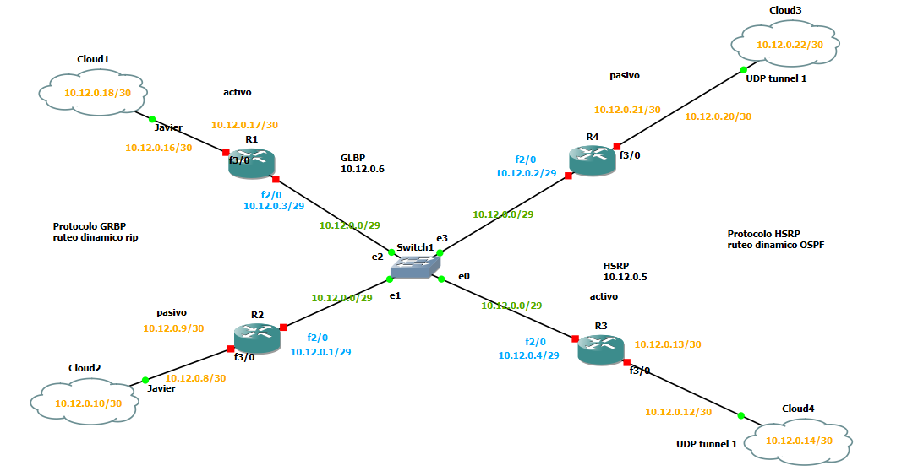
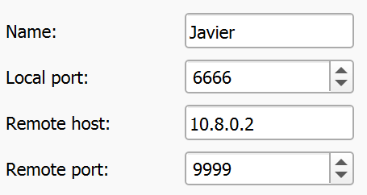
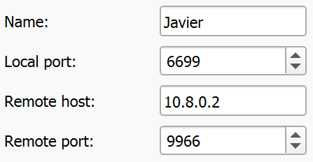
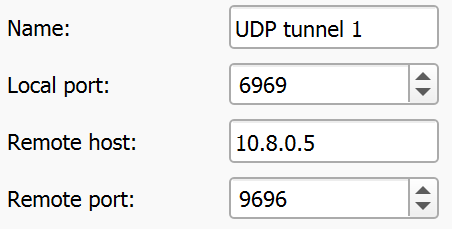
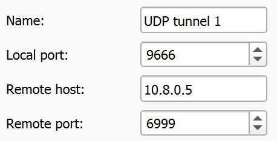

## Topología 1

---
### Configuración de Subredes con VSLM
---
#### Datos
**Dirección dada:** 10.12.0.0/16
**Número de subredes:** 5
**Host por subredes:** 4,2,2,2,2

***Cálculo de bits por hosts de 4***
2^n−2 ≥ H
2^3−2 = 6 ≥ 4 ⟹n=3

***Cálculo de bits por hosts de 2***
2^n−2 ≥ H
2^2−2 = 2 ≥ 2 ⟹n=2

***Cálculo del número de bits de subred de 4 host***
R=(32−p)−n
R=(32−16)−3=13
*Se tomarán 13 bits del host para el cálculo*

***Cálculo del número de bits de subred de 2 host***
R=(32−p)−n
R=(32−16)−2=14
*Se tomarán 14 bits del host para el cálculo*

***Cálculo de la máscara de subred de 4 host***
p = 16+13 = 29
<strong>11111111.11111111.</strong><strong>11111111.11111</strong><strong>000</strong>
255.255.255.248

***Cálculo de la máscara de subred de 2 host***
p = 16+14 = 30
<strong>11111111.11111111.</strong><strong>11111111.111111</strong><strong>00</strong>
255.255.255.252

***Cálculo de salto de red de 4 host***
S = 256−248 = 8

***Cálculo de salto de red de 2 host***
S = 256−252 = 4

|**Subred**|**Nº de Hosts**|**IP de red**|**Máscara**|**Primer Host**|**Último Host**|**Broadcast**|
| :- | :- | :- | :- | :- | :- | :- |
|Subred 1|6|10.12.0.0 /29|255.255.255.248|10.12.0.1|10.12.0.6|10.12.0.7|
|Subred 2|2|10.12.0.8 /30|255.255.255.252|10.12.0.9|10.12.0.10|10.12.0.11|
|Subred 3|2|10.12.0.12 /30|255.255.255.252|10.12.0.13|10.12.0.14|10.12.0.15|
|Subred 4|2|10.12.0.16 /30|255.255.255.252|10.12.0.17|10.12.0.18|10.12.0.19|
|Subred 5|2|10.12.0.20 /30|255.255.255.252|10.12.0.21|10.12.0.22|10.12.0.23|

---

### Configuración de IP's en puertos de routers

- __R1__

~~~
conf t

int Fa2/0
ip address 10.12.0.3 255.255.255.248
duplex auto
speed auto

exit

int Fa3/0
ip address 10.12.0.17 255.255.255.252
duplex auto 
speed auto

exit
~~~

- __R2__

~~~
conf t

int Fa2/0
ip address 10.12.0.1 255.255.255.248
duplex auto 
speed auto

exit

int Fa3/0
ip address 10.12.0.9 255.255.255.252
duplex auto 
speed auto

exit
~~~

- __R3__

~~~
conf t

int Fa2/0
ip address 10.12.0.4 255.255.255.248
duplex auto 
speed auto

exit

int Fa3/0
ip address 10.12.0.13 255.255.255.252
duplex auto 
speed auto

exit
~~~

- __R4__

~~~
conf t

int Fa2/0
ip address 10.12.0.2 255.255.255.248
duplex auto 
speed auto

exit

int Fa3/0
ip address 10.12.0.21 255.255.255.252
duplex auto 
speed auto

exit
~~~
---
### Configuración RIP

~~~
conf t
router rip
version 2
network 10.0.0.0
~~~
---

### Configuración HSRP

***Activo***
__R3__

~~~
conf t
int fa2/0
standby 1 ip 10.12.0.5
standby 1 priority 150
standby 1 preempt
~~~

***Pasivo***
__R4__
~~~
conf t
int fa2/0
standby 1 ip 10.12.0.5
~~~

---
### Configuración GLBP

***Activo***
__R1__
~~~
conf t
int fa2/0
glbp 1 ip 10.12.0.6
glbp 1 priority 150
glbp 1 preempt
~~~

***Pasivo***
__R2__
~~~
conf t
int fa2/0
glbp 1 ip 10.12.0.6
~~~
---

### Configuración de clouds

**Cloud1 (Hacia topología 2)**

**Cloud2 (Hacia topología 2)**

**Cloud3 (Hacia topología 3)**

**Cloud4 (Hacia topología 3)**

---