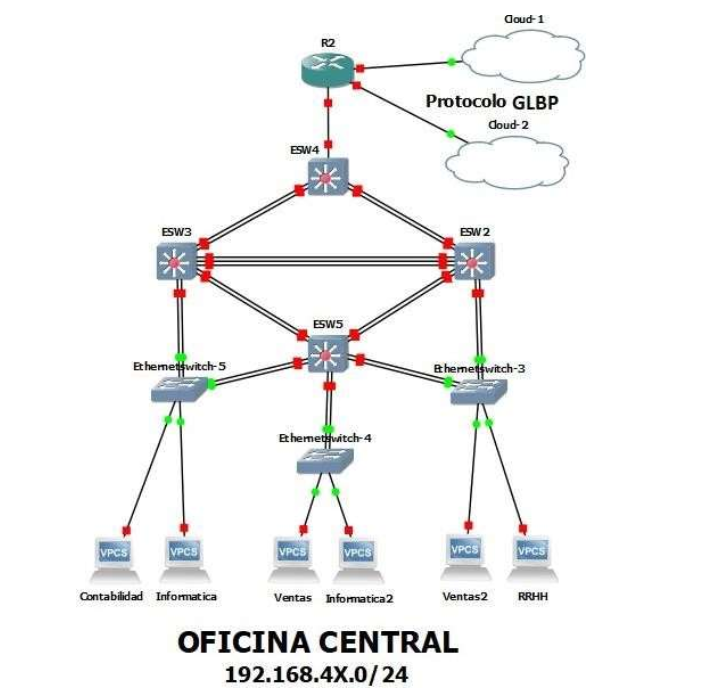
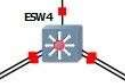
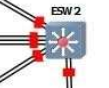
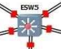
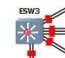
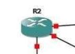

# Topología 2 (Oficina Central)



### Configuración de enlaces troncales para ESW2, ESW3, ESW4 y ESW5

como primer paso se configura la redundancia en los switch de capa 3 para que la comunicación sea efectiva, de todos los switch se establece uno como un switch server en el que se crean las vlans y luego se replican hacia las demás.

### ESW4 (Switch Server) 

###  

#### Configuración de VTP
```bash
conf ter

vtp domain redes1gp12

vtp password redes1gp12

vtp mode server
```

#### Configuración de PortChannel (Agrupar todas las interfaces para redundancia)
```bash
conf ter

interface range f1/1 - 2

channel-group 1 mode on

end

//validar configuración 

show etherchannel port-channel

conf ter

interface range f1/3 - 4

channel-group 2 mode on

end

show etherchannel summary

-- mode trunk de portchanels

#conf ter

#interface port-channel 1

#switchport mode trunk

#switchport trunk allowed vlan 1,10,20,30,40,1002-1005

#end

#show int trunk

#conf ter

#interface port-channel 2

#switchport mode trunk

#switchport trunk allowed vlan 1,10,20,30,40,1002-1005

#end

#show int trunk

-- conexion a router

#conf ter

#interface f1/0

#switchport mode trunk

#switchport trunk allowed vlan 1,10,20,30,40,1002-1005

-- configurar vlans

#conf ter

#vlan 10

#name RHUMANOS

#exit

#vlan 20

#name CONTABILIDAD

#exit

#vlan 30

#name VENTAS

#exit

#vlan 40

#name INFORMATICA

#exit

#shown vlan-sw

//configuracion de stp

#conf ter

#vtp pruning

#conf ter

#spanning-tree vlan 10 root primary

#spanning-tree vlan 20 root primary


#spanning-tree vlan 30 root primary

#spanning-tree vlan 40 root primary

//verificar stp

#sh spanning-tree brief

//ver puertos

#show spanning-tree blockedports
```

### ESW2 (Cliente)

### 


```bash
-- CONFIGURACION DE PORTCHANNEL (AGRUPAR TODAS LAS INTERFACES PARA REDUNDANCIA)

#conf ter

#interface range f1/8 - 9

#channel-group 6 mode on

#end

//validar configuración 

#show etherchannel port-channel

#conf ter

#interface range f1/1 - 2

#channel-group 3 mode on

#end

//validar configuración 

#show etherchannel port-channel

#show etherchannel summary

#conf ter

#interface range f1/5 - 7

#channel-group 5 mode on

#end

-- mode trunk de portchanels

#conf ter

#interface port-channel 2

#switchport mode trunk

#switchport trunk allowed vlan 1,10,20,30,40,1002-1005

#end

#show int trunk

#conf ter

#interface port-channel 3

#switchport mode trunk

#switchport trunk allowed vlan 1,10,20,30,40,1002-1005

#end

#show int trunk

#interface port-channel 5

#switchport mode trunk

#switchport trunk allowed vlan 1,10,20,30,40,1002-1005

#end

#show int trunk

-- agregar vtp

#conf ter

#vtp domain redes1gp12

#vtp password redes1gp12

#vtp mode client

#end

#vtp status

#show vlans 

### ESW5 (Cliente) 

### 

-- CONFIGURACION DE PORTCHANNEL (AGRUPAR TODAS LAS INTERFACES PARA REDUNDANCIA)

#conf ter

#interface range f1/1 - 2

#channel-group 3 mode on

#end

//validar configuración 

#show etherchannel port-channel

#conf ter

#interface range f1/3 - 4

#channel-group 4 mode on

#end

//validar configuración 

#show etherchannel port-channel

#show etherchannel summary

-- mode trunk de portchanels

#conf ter

#interface port-channel 3

#switchport mode trunk

#switchport trunk allowed vlan 1,10,20,30,40,1002-1005

#end

#show int trunk

#conf ter

#interface port-channel 4

#switchport mode trunk

#switchport trunk allowed vlan 1,10,20,30,40,1002-1005

#end

#show int trunk

-- agregar vtp

#conf ter

#vtp domain redes1gp12

#vtp password redes1gp12

#vtp mode client

#end

#vtp status

#show vlan-sw
```

```bash
### ESW3 (Cliente)

### 


-- CONFIGURACION DE PORTCHANNEL (AGRUPAR TODAS LAS INTERFACES PARA REDUNDANCIA)

#conf ter

#interface range f1/1 - 2

#channel-group 1 mode on

#end

//validar configuración 

#show etherchannel port-channel

#conf ter

#interface range f1/3 - 4

#channel-group 4 mode on

#end

//validar configuración 

#show etherchannel port-channel

#show etherchannel summary

#conf ter

#interface range f1/5 - 7

#channel-group 5 mode on

#end

//validar configuración 

#show etherchannel port-channel

-- mode trunk de portchanels

#conf ter

#interface port-channel 1

#switchport mode trunk

#switchport trunk allowed vlan 1,10,20,30,40,1002-1005

#end

#show int trunk

#conf ter

#interface port-channel 4

#switchport mode trunk

#switchport trunk allowed vlan 1,10,20,30,40,1002-1005

#end

#show int trunk

#conf ter

#interface port-channel 5

#switchport mode trunk

#switchport trunk allowed vlan 1,10,20,30,40,1002-1005

#end

#show int trunk

-- agregar vtp

#conf ter

#vtp domain redes1gp12

#vtp password redes1gp12

#vtp mode client

#end

#vtp status

#show vlan-sw 
```

### R2 (Router de topologia)

###  
```bash
Se crean vlans y se establece el modo trunk a traves de Dot1Q

#conf ter

#interface f1/0

#no shutdown

#int f1/0.10

#int f1/0.20

#int f1/0.30

#int f1/0.40

#do sh run

int f1/0.10

encapsulation dot1Q 10

int f1/0.20

encapsulation dot1Q 20

int f1/0.30

encapsulation dot1Q 30

int f1/0.40

encapsulation dot1Q 40

#interface f1/0

#no shutdown

#int f1/0.10

#encapsulation dot1Q 10

#ip address 192.168.43.222 255.255.255.224

#int f1/0.20

#encapsulation dot1Q 20

#ip address 192.168.43.238 255.255.255.240

#int f1/0.30

#encapsulation dot1Q 30

#ip address 192.168.43.126 255.255.255.128

#int f1/0.40

#encapsulation dot1Q 40

#ip address 192.168.43.190 255.255.255.192
```

## Distribución Topologia 2
| Deprtamento  | Distribución        | Cantidad |
|--------------|---------------------|----------|
| RRHH         | Gerente             | 1        |
|              | Reclutadores        | 15       |
|              | Analistas           | 5        |
|              | **Total**           | **21**   |
| Contabilidad | Gerente             | 1        |
|              | Asistente de Conta. | 5        |
|              | Contador General    | 1        |
|              | Auditor             | 1        |
|              | **Total**           | **8**       |
| Ventas       | Operadores de Ventas  | 76       |
|              | Encargados de Cuentas | 4        |
|              | Manager               | 12       |
|              | Gerente               | 1        |
|              | **Total**             | **93**       |
|              | **Crecimiento Prev**  | **≈ 123**    |
| Informática | Programadores           | 15       |
|             | Gestor de Proyectos     | 5        |
|             | Admin de Base de Datos  | 1        |
|             | Analista de Infrastruc. | 3        |
|             | Tester                  | 6        |
|             | Gerente                 | 1        |
|             | **Total**               | **31**      |
|             | **Crecimiento Prev**    | **≈ 37**     |

### Configuracion de VPC'S

```bash
#Ventas
ip 192.168.43.1/24 192.168.84.126
ip 192.168.43.2/24 192.168.84.126 
#Informatica
ip 192.168.43.129/24 192.168.84.190
ip 192.168.43.130/24 192.168.84.190
#RRHH
ip 192.168.43.193/24 192.168.84.222
#Contabilidad
ip 192.168.43.225/24 192.168.84.238 
```

### Configuracion de router topo 2 - sub interfaces

```bash
#sub-interfaces
conf t
int f1/0
no shut
int f1/0.10
int f1/0.20
int f1/0.30
int f1/0.40

#chequear que existan las sub-interfaces
do sh run

exit

int f1/0.10
encapsulation dot1Q 10 
ip address 192.168.43.222 255.255.255.224

int f1/0.20
encapsulation dot1Q 20
ip address 192.168.43.238 255.255.255.240

int f1/0.30
encapsulation dot1Q 30
ip address 192.168.43.126 255.255.255.128

int f1/0.40
encapsulation dot1Q 40
ip address 192.168.43.190 255.255.255.192

```
### Configuracion de router con topo 1
```bash
#conexion a topologia 1
conf t
interface FastEthernet2/0
ip address 10.12.0.18 255.255.255.252
duplex auto
speed auto
no shut
exit
interface FastEthernet3/0
ip address 10.12.0.10 255.255.255.252
duplex auto
speed auto
no shut
end
```
### Configuracion de router rip
```bash
conf t
#router rip
version 2
network 10.0.0.0
network 192.168.43.0
```
